#### Marco Aurélio Souza
#### Paulo R. K. Nakaima
#### Rodrigo R. Veras

# Projeto de algorítmos Genéticos

### Introdução

Algorítmos genéticos são um técnica de busca para achar soluções aproximadas em problemas de otimização e busca. Pertencem às classes de algorítmos evolutivos usados pela ciência da computação que utilizam métodos baseados nos conceitos da biologia, mais especificamente da teoria evolutiva de Charles Darwin.

Os conceitos evolutivos usados pelos algorítmos genéticos são a hereditariedade, seleção, recombinação e a mutação.
Neste presente trabalho será demonstrado uma seção com o problema proposto, uma seção solução para esse problema e os resultados. A solução utilizará os conceitos dos Algorítmos genéticos. 

### Problema proposto

Das funções de benchmarket do artigo "Fast Evolutionary Programming" de Xin Yao e Yong Liu, foram escolhidas as funções F1 e F6, cujos os domínios são ambos [-100, 100] e o mínimo das duas funções é 0.

O objetivo será aplicar os conceitos dos algorítmos genéticos para tentar otimizar a busca de soluções para as duas funções propostas. Neste caso, solucionar as funções é encontrar o mínimo de ambas.

### Solução proposta

Para solucionar o problema e encontrar o ponto mínimo de cada função, serão usados os seguintes parametros evolutivos para construir o algorítmo:

* **Tamnho da população:** um valor de n escolhido antes da execução do algorítmo; 
* **Tamanho do cromossomo**: 30 genes, cujos são determinados aleotoriamente entre -100 e 100 (domínio);
* **Seleção:** será feita por roleta proporcional à aptidão baseado nos calculos de probabilidades e probabilidades acumuladas;
* **Crossover:** simples com único ponto de corte, cuja posição será escolhida aleatoriamente entre 1 e 28. O tipo utilizado será o aritmético, cuja a taxa será de inicialmente 70% e com o valor de lambda escolhido inicialmente como 0.3; 
* **Mutação:** creep (uma mutação considerada agressiva), cujo valor usado para multiplicar com o gene que deve ser mutado será escolhido aleatoriamente entre 1 e 0. A taxa de mutação inicialmente será de 1%;
 
Os valores são ditos iniciais por hora, pois, durante a realização dos experimentos, tais valores serão alterados a fim de se observar como se comporta o algorítmo ao longo das mudanças.

### Resultados

A seguir serão exibidos os resultados. Primeiramente, o algorítmo genético proposto, em seguida a tabela com as valores dos parametros usados no algorítmo e finalmente os gráficos que representam a curva de convergência de cada um dos resultados.

### Código

#### Cromossomo


```python
class Cromossoma:
  cromossoma = []
  
  def make_cromossoma(self):
    for i in range(30):
      gene = round(random.uniform(-100, 100), 3)
      self.cromossoma.append(gene)
    return self.cromossoma
  
  def empty(self):
    self.cromossoma.clear()
```

#### População


```python
class Population:
  population = []
  def init_population(self):
    cromossoma = Cromossoma()
    l = 0
    while (l < 10):
      ind = cromossoma.make_cromossoma()
      self.population.append(ind.copy())
      l = 1 + l
      cromossoma.empty()

  def get_population(self):
    return self.population
  
  def empty(self):
    self.population.clear()
 
```

#### Fitness da função 1


```python
class Fitness:
  fitness = 0
  list_fitness = []
  def set_fitness(self, population):
    sm = 0 
    for cromossoma in population:
      sm = 0
      for gene in cromossoma:
        sm = gene**2 + sm

      self.fitness = sm
      self.list_fitness.append(self.fitness)
      self.fitness = 0
  def get_fitness(self):
    return self.list_fitness
  def empty_list_fitness(self):
    self.list_fitness.clear()
```

#### Fitness da função 2


```python
class Fitness:
  fitness = 0
  list_fitness = []
  def set_fitness(self, population):
    sm = 0
    for cromossoma in population:
      sm = 0
      for gene in cromossoma:
      
        sm += (gene + 0.5)
      
      self.fitness = round(sm, 2)
      self.list_fitness.append(self.fitness)
      self.fitness = 0
      
  def get_fitness(self):
    return self.list_fitness
  def empty_list_fitness(self):
    self.list_fitness.clear()
```

#### Seleção


```python
import random

class Selection:

  probabilities = []
  probability = 0
  acumulateds = [] 
  randomNumbers = []
  newPopulation = []

  def calcule_probabilities(self, fitnessList):
    self.probabilities.clear()
    sumFitness = 0
    for fitness in fitnessList:
      sumFitness = fitness + sumFitness
  
    for fitness in fitnessList:
      self.probability = fitness/sumFitness
      self.probabilities.append(self.probability)

  def acumulated_probabilities(self):
    self.acumulateds.clear()
    for i in range(len(self.probabilities)):
      sumProbs = 0
      for j in range(i, -1, -1):
        sumProbs = self.probabilities[j] + sumProbs
      self.acumulateds.append(sumProbs)
  
  def generate_random_numbers(self, n):
    self.randomNumbers.clear()
    
    for i in range(n):
      self.randomNumbers.append(round(random.uniform(-1, 1), 3))

  def run_roulette(self, fitnessList):
    positions = []
    
    self.calcule_probabilities(fitnessList)
    self.acumulated_probabilities()
    self.generate_random_numbers(len(fitnessList))

    for randomNumber in self.randomNumbers:
      for acumulated in self.acumulateds:
        if(acumulated >= randomNumber):
          positions.append(self.acumulateds.index(acumulated))
          break

    return positions

  def get_new_population(self, fitnessList, oldPopulation):
    positions = self.run_roulette(fitnessList)
    self.newPopulation.clear()
    
    for position in positions:
      self.newPopulation.append(oldPopulation[position])
    
    return self.newPopulation
```

#### Crossover e Mutação


```python
class Reproduction:
  
  _Pc = 0.8
  _Pm = 0.01
  def generate_random_numbers(self, n):
    randomNumbers = [] 
    # n é o tamanho da população
    # gerar número aleatórios de 0 a 1
    for i in range(n):
      randomNumbers.append(round(random.uniform(0, 1), 3))
    return randomNumbers
  
  def selecting_individuals(self, n):
    positions = []
    randomNumbers = self.generate_random_numbers(n)

    for randomNumber in randomNumbers:
      if(randomNumber <= self._Pc):
        positions.append(randomNumbers.index(randomNumber))

    return positions
  
  def defining_engageds(self, n):
    positions = self.selecting_individuals(n)
    engageds = []

    i = 0
    if(len(positions)%2 == 0):
      while(i < len(positions)):
        
        engageds.append([positions[i], positions[i + 1]])
        i = i + 2
    else:
      while(i < len(positions) - 1):
        engageds.append([positions[i], positions[i + 1]])
        i = i + 2

    return engageds # pares cruzantes de posiçoes da nova população
  
  def crossover(self, newPopulation):
    
    engageds = self.defining_engageds(len(newPopulation))
    
    for engaged in engageds:
      crossover_point = random.randint(1, 29)
      
      cromossoma_1 = newPopulation[engaged[0]]
      cromossoma_2 = newPopulation[engaged[1]]

      cromossoma_copy_1 = cromossoma_1.copy()
      cromossoma_copy_2 = cromossoma_2.copy()
      
      childs = arithmetic_crossover.crossover(cromossoma_copy_1, cromossoma_copy_2, 0.3)

      newPopulation[engaged[0]] = childs[0]
      newPopulation[engaged[1]] = childs[1]
    
    return newPopulation
  
  def mutation(self, population):
    row_length = len(population)
    column_length = len(population[0])

    mutation_points = []
    matrix_rand = np.zeros([row_length,column_length], dtype=float)

    for i in range(row_length): 
      for j in range(column_length):
        
        matrix_rand[i][j] = round(random.uniform(0, 1), 3)
        
        if (matrix_rand[i][j] <= self._Pm):
          mutation_points.append([i, j])
    
    for point in mutation_points:
      
      current_gene = population[point[0]][point[1]]
      population[point[0]][point[1]] = current_gene * 0.02
    
    return population

```

#### Sobreviventes


```python
class Elitism:


  def saveTheBest(self, population_initial, population_final, fit_initial, fit_final):
    best_fit_initial = max(fit_initial)
    best_fit_final = max(fit_final)

    worst_fit_final = min(fit_final)
    position_worst_final = fit_final.index(worst_fit_final)
    position_best_initial = fit_initial.index(worst_fit_final)
     
    cromossoma_tam = len(population_final[position_best_initial])
      
    for i in range(0, cromossoma_tam):
      population_final[position_worst_final][i] = population_initial[position_best_initial][i]

   

    return population_final
```

#### Main


```python
from cromossoma import Cromossoma
from population import Population
from fitness import Fitness
from selection import Selection
from reproduction import Reproduction
from elitism import Elitism
from plot import Plot
import matplotlib.pyplot as plt
from matplotlib.figure import Figure


fig1 = plt.figure(FigureClass=Plot, figtitle='fitness 1 (min)')
fig2 = plt.figure(FigureClass=Plot, figtitle='fitness 1 (max)')
fig3 = plt.figure(FigureClass=Plot, figtitle='fitness 1 (total)')

ax = fig1.subplots()
ay = fig2.subplots()
az = fig3.subplots()

min_fitness = []
max_fitness = []
total_fitness = []
pop = []
result_pop = []
elitism = Elitism()
population = Population() 
population.init_population()
fit = Fitness()
reproduction = Reproduction()
selection = Selection()
pop = population.get_population()
i = 0

try:
  while (i < 200):
    
    fit.set_fitness(pop.copy())
    fit_initial = fit.get_fitness()
    total_fitness.extend(fit.get_fitness())
    min_fitness.append(min(fit.get_fitness()))
    max_fitness.append(max(fit.get_fitness()))

    # stop condition
    if 0.0 in fit.get_fitness():
      #print(min_fitness)
      #print(pop.copy())
      print(fit_initial)
      ax.plot(min_fitness, 'g')
      ay.plot(max_fitness, 'r')
      az.plot(total_fitness)
      plt.show()
      print("achei")
      break
    # selected population
    selected_population = selection.get_new_population(fit.get_fitness().copy(), pop.copy())
    fit.empty_list_fitness()
    # diversity operations
    new_pop = reproduction.crossover(selected_population.copy())
    mutade_pop = reproduction.mutation(new_pop.copy())
    fit_mutated = fit.set_fitness(mutade_pop.copy())
    fit_final = fit.get_fitness()
    result_pop = elitism.saveTheBest(pop.copy(), mutade_pop.copy(), fit_initial.copy(), fit_final.copy())
    
    pop.clear()
    selected_population.clear()
    new_pop.clear()
    # new generation
    pop = result_pop.copy()
    
    mutade_pop.clear()
    result_pop.clear()
    fit.empty_list_fitness()

    i += 1
except KeyboardInterrupt:
  print("interrupt received, stopping...")
finally:
  print(pop.copy())
  print(min_fitness)
  ax.plot(min_fitness, 'r')
  ay.plot(max_fitness)
  az.plot(total_fitness)
  plt.show()
  
  
```

#### função 1
Em cada execução foi utilizado um população inicial aleatória diferente. A coluna seção refere-se à seção onde os gráficos resultantes estão localizados.

|Pc|Pm|Lambda|nº de gerações: 1º execução| nº de gerações: 2º execução| nº de gerações: 3º execução| seção |
|:-:|:-:|:-:-|:-:|:-:|:-:|:-:|
|60%|1%|0.1|50|30|35|1|
|60%|2%|0.3|40|30|48|2|
|60%|3%|0.3|25|37|28|3|
|70%|1%|0.3|45|35|35|4|
|80%|1%|0.3|30|50|40|5|
|60%|1%|0.2|40|40|40|6|

0.6 <= pc <=0.8 and 0.01 <= pm <= 0.03 and 0.1 <= lamb <= 0.3 número de gerações: 200, tamanho da populção: 100, executado três vezes para cada caso

#### função 6

Em cada execução foi utilizado um população inicial aleatória diferente

|Pc|Pm|Lambda|nº de gerações: 1º execução| nº de gerações: 2º execução| nº de gerações: 3º execução|seção |
|--|--|--|--|--|---|--|
|60%|1%|0.1|200|400|400|7|
|60%|2%|0.3|400|400|400|8|
|60%|3%|0.3|400|400|400|9|
|70%|1%|0.3|400|400|400|10|
|80%|1%|0.3|400|400|400|11|
|60%|1%|0.2|400|400|400|12|

### Gráficos

A seguir, os gráficos gerados pelas execuções dos algoritmo com os parametros atribuídas na tabela acima. Em cada figura está expresso no eixo x o número de fitness gerados e no eixo y os respectivos valores de cada fitness gerado. O valor de x divido por 100 é igual ao número de gerações.

Para cada conjunto de parâmetros definidos nas tabelas supracitadas, o algorítmo é executado três vezes. Abaixo são exibidos os gráficos resultantes.

Nos gráficos da função 1 os valores de fitness dos cromossomos convergem e chegam ao valor zero, enquanto na função 6 aproximam-se de zero e, em seguida, estabilizam-se em 15.

#### Seção 1

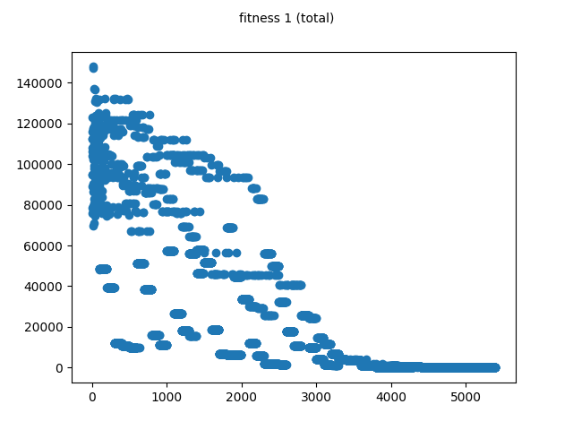

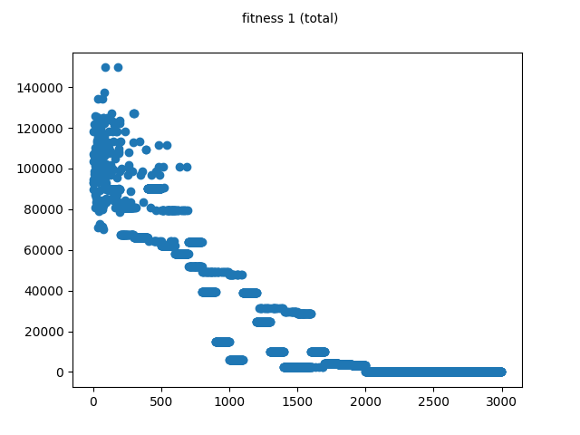

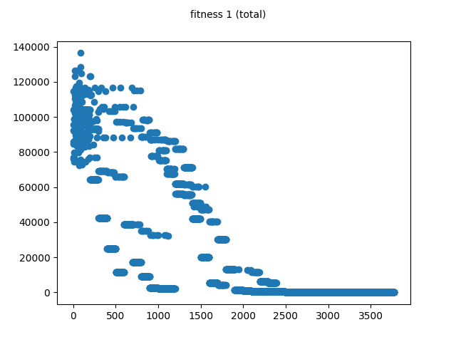

#### Seção 2

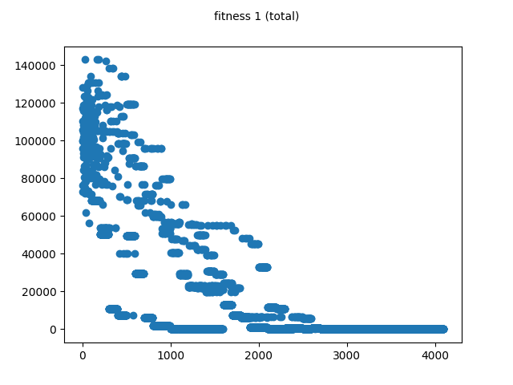

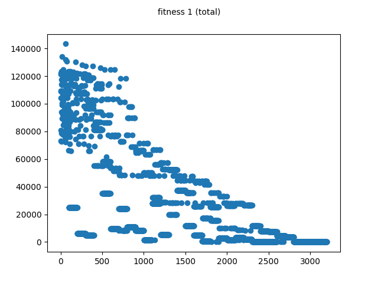

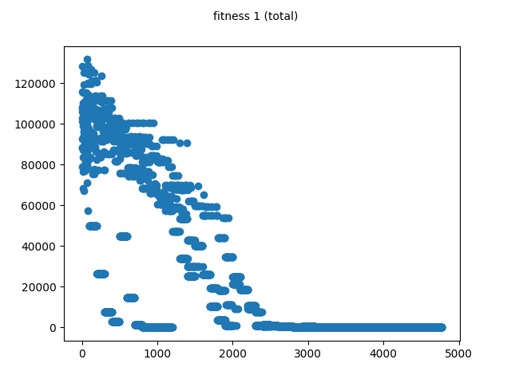

#### Seção 3

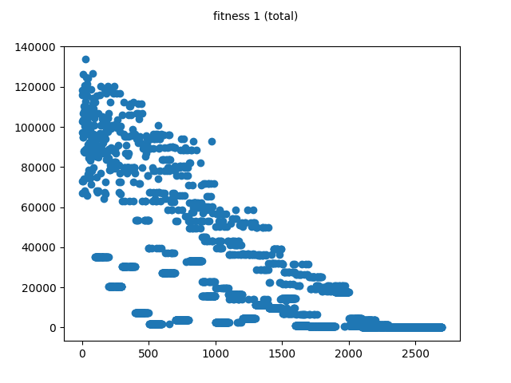

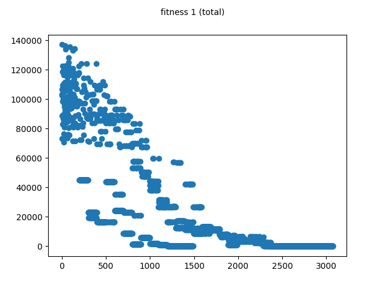

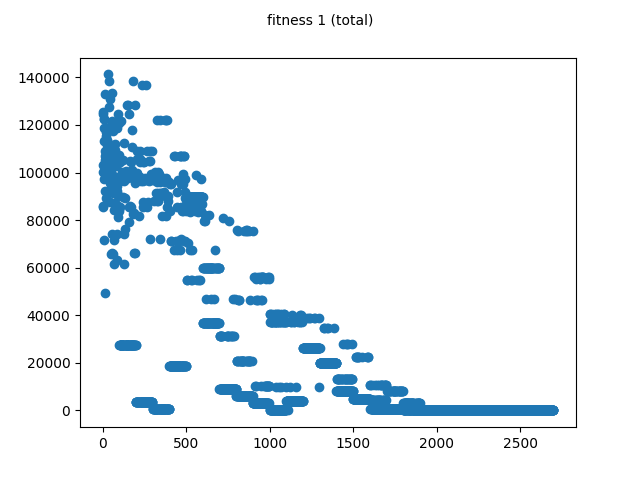

#### Seção 4

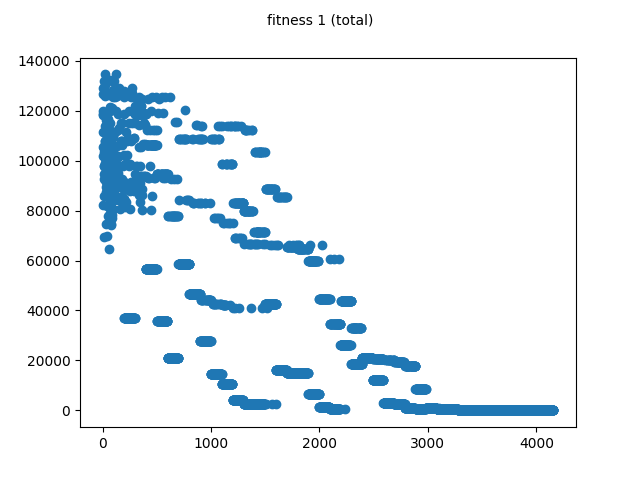

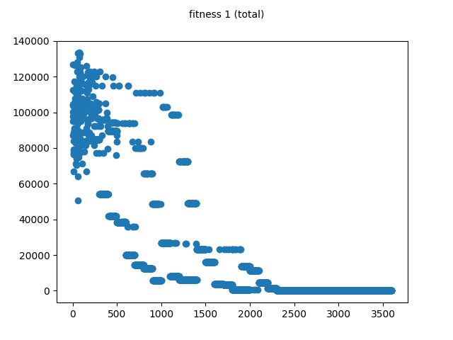

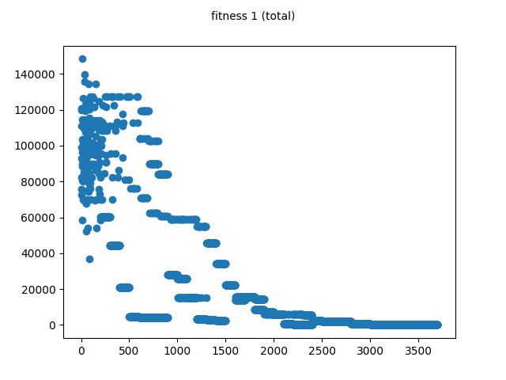

#### Seção 5

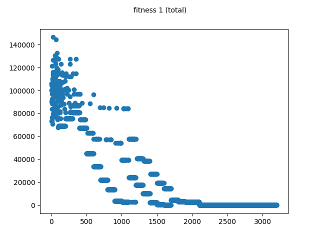

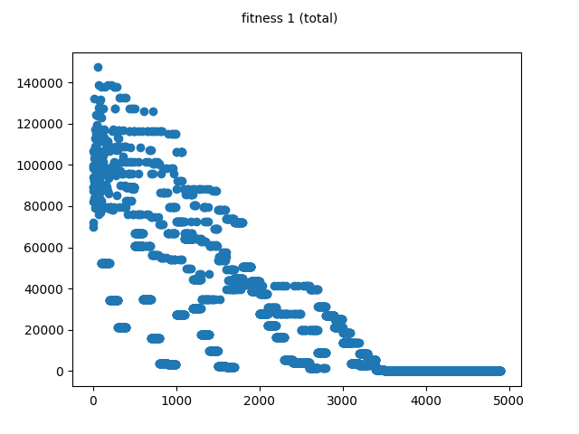

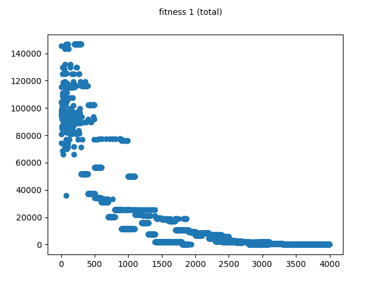

#### Seção 6

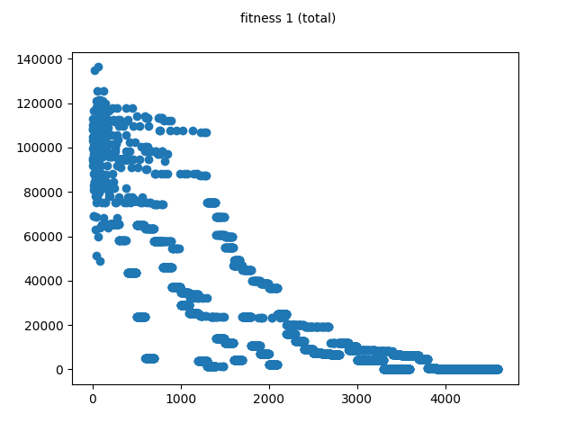

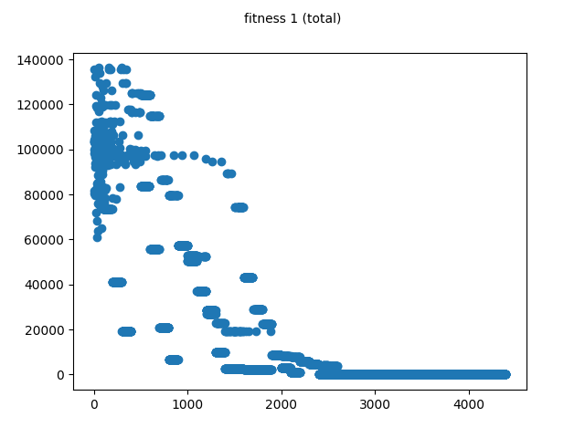

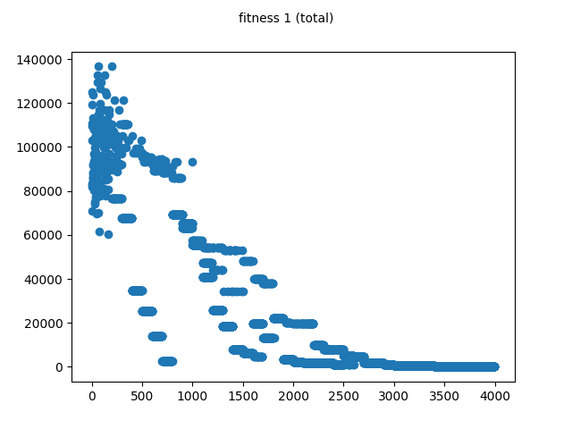

#### Seção 7

.png)

.png)

.png)

#### Seção 8

.png)

.png)

.png)

#### Seção 9

.png)

.png)

.png)

#### Seção 10

.png)

.png)

.png)

#### Seção 11

.png)

.png)

.png)

#### Seção 12

.png)

.png)

.png)


```python

```
